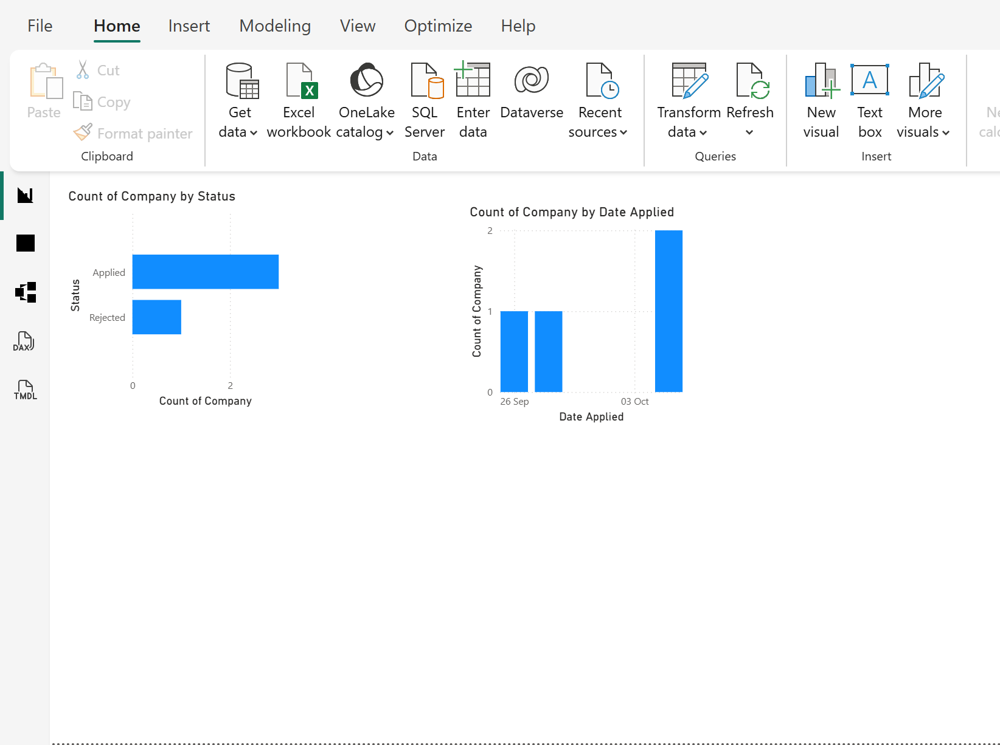

# Job Search Dashboard

A Power BI dashboard tracking my own UK Data/AI job search — built on real data from my
application tracker, not a sample dataset.

## Why this project
Most portfolio dashboards use the same handful of public datasets (sales, retail, movies).
This one uses something I actually understand inside out: my own job search. It's also
genuinely useful — I update the source data every time I apply somewhere, so the dashboard
stays current.

## What it shows
- **Applications by Status** — how many applications are Applied, Rejected, Interview
  Scheduled, etc.
- **Applications over Time** — when I actually applied, so I can see the pace of my search

## Tools
Power BI Desktop, Power Query (for cleaning the source data)

## How it works
1. Connects directly to `06_applications/application_tracker.xlsx` (Applications and
   Outreach sheets)
2. Power Query cleans the data on load — the biggest fix needed was converting date columns
   from raw Excel serial numbers (e.g. `46291`) into actual dates
3. Visuals are built from the cleaned tables, and refresh automatically from the source file

## A real problem I ran into and fixed
Excel dates often import into Power BI as plain numbers rather than dates, because of how
Excel stores dates internally. I had to manually set the correct data type on each date
column in Power Query before the visuals could use them properly — a good reminder that
raw data rarely arrives ready to use.

## What I'd do next
- Add a card showing outreach emails sent vs. replies received
- Add a response-rate measure (percentage of applications that got any reply)
- Refresh this as my application count grows, to see real trends over a longer period
